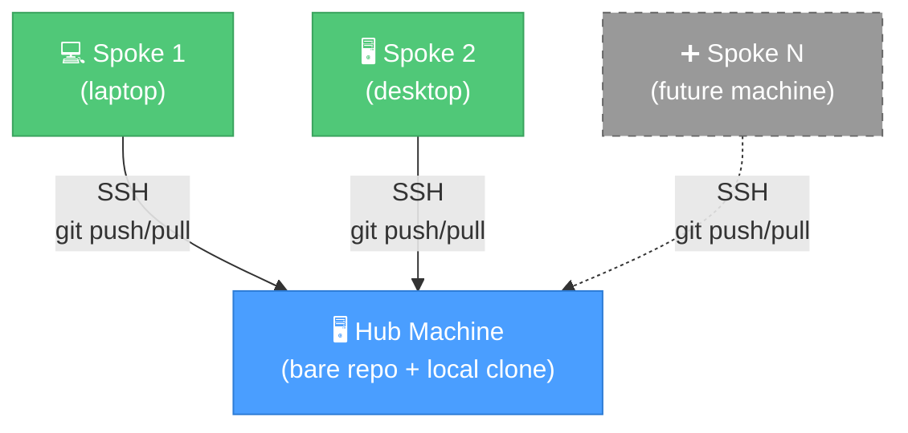

# "Wait, I already told you this" -- Claude Memory Sync

[](LICENSE)
[](https://www.gnu.org/software/bash/)
[](https://claude.com/claude-code)
[](https://github.com/KerberosClaw/kc_claude_memory_sync/actions/workflows/test.yml)

[正體中文](README_zh.md)

Sync [Claude Code](https://claude.com/claude-code) memory across multiple machines using a private Git bare repo over SSH. No cloud services, no third-party storage -- your memory stays on your own machines.

---

## The Problem (a.k.a. Why We Built This)

Here's a fun one: you spend an hour teaching Claude your coding preferences, your project architecture, your pet peeves about trailing whitespace. Claude dutifully remembers all of it -- in `~/.claude/projects/` as Markdown files. Beautiful.

Then you SSH into your home server, fire up a tmux session, and Claude greets you like a stranger. Because it is. Different machine, different memory, zero shared context. All those carefully accumulated preferences? Trapped on whatever machine you happened to be using when you taught them. And the machine you're on right now has no idea any of that ever happened.

We got tired of re-explaining ourselves, so we built this. One bare repo, SSH, and a hook that makes Claude's memory follow you across machines -- no cloud required.

## Architecture

Hub-and-spoke: one machine holds the truth (the hub), everyone else syncs to it. Think of it as a git remote, except the only thing it stores is Claude's opinions about your code style.



**How it actually works:**
- Claude writes a memory file -> `PostToolUse` hook fires -> auto `git commit + push`. You don't do anything.
- Push is fire-and-forget -- took your laptop to a cafe with no VPN? Push silently skips. No errors, no drama.
- Next time you're on the same network, changes sync up automatically. It just works. (We're as surprised as you are.)

**Got a new machine?** Just run `./setup.sh join`. That's it. No config changes on the hub, no coordinating with other spokes, no ritual sacrifices.

## Prerequisites

Before we get started, you'll need a few things. Nothing exotic:

- Two or more macOS/Linux machines (sorry, we haven't tested on Windows -- PRs welcome if you're braver than us)
- Git, Python 3, and `jq` on all machines (`brew install jq`)
- Claude Code installed on all machines
- Passwordless SSH from each spoke to the hub. If you haven't set this up, it's one command:
  ```bash
  ssh-copy-id -i ~/.ssh/id_ed25519.pub user@hub-host
  ```

## Quick Start

### 1. Hub Machine (run once, then forget about it)

```bash
git clone https://github.com/<your-user>/kc_claude_memory_sync.git ~/dev/kc_claude_memory_sync
cd ~/dev/kc_claude_memory_sync
./setup.sh init-hub
```

The script handles the boring parts:
1. Creates a bare Git repo on this machine
2. Scoops up your existing memory files into the repo
3. Auto-merges and deduplicates the `MEMORY.md` index (because of course you had duplicates)
4. Sets up the symlink and Claude Code hook

### 2. Spoke Machines (each one that wants in)

```bash
git clone https://github.com/<your-user>/kc_claude_memory_sync.git ~/dev/kc_claude_memory_sync
cd ~/dev/kc_claude_memory_sync
./setup.sh join
```

This will:
1. Verify SSH connection to the hub (fails fast if something's wrong -- you're welcome)
2. Clone the memory repo from the hub
3. Merge any local memory files, with conflict detection so nothing gets silently lost
4. Set up the symlink and Claude Code hook

### The Lazy Way (Claude Code Automation)

A `CLAUDE.md` is included in the project. Just tell Claude Code "help me set up memory sync" and it will read the instructions and handle everything. We wrote the automation guide so you don't have to think. You're welcome.

## How It Works

### The Hook That Does All the Work

A `PostToolUse` hook watches for `Write` and `Edit` tool calls. When Claude modifies a memory file, three things happen in quick succession:

1. Hook detects the file is inside the memory repo (follows the symlink, checks the real path -- it's not easily fooled)
2. Acquires a file lock (because if you're running three tmux panes with Claude sessions, we don't want three simultaneous `git push` commands fighting each other)
3. `git add` + `git commit` + `git push` -- or if the hub is unreachable, quietly moves on with its life

### Memory Merge (The "First Date" Problem)

When you run `join`, your local memories meet the hub's memories for the first time. It can be awkward. Here's how we handle it:

| Scenario | What Happens |
|----------|--------|
| File only on this machine | Added to repo -- the more memories, the merrier |
| File only on hub | Kept as-is |
| Same filename, same content | Skipped -- great minds think alike |
| Same filename, different content | Both kept (`*_conflict.md` for you to review -- we're not going to pick favorites) |
| `MEMORY.md` | Auto-merged: entries combined and deduplicated |

### Manual Sync (For Control Freaks)

```bash
~/dev/claude-memory/.sync.sh sync      # pull then push
~/dev/claude-memory/.sync.sh pull      # pull only
~/dev/claude-memory/.sync.sh push      # push only
~/dev/claude-memory/.sync.sh status    # show sync status
```

### Sync Status (Am I Even Synced?)

When you're not sure if your memories made it across, `status` gives you the full picture:

```
$ ~/dev/claude-memory/.sync.sh status

=== Claude Memory Sync Status ===

Hub:           user@192.168.1.100 — reachable
Last commit:   2026-03-21 14:32:05 +0800
               memory sync 2026-03-21 14:32:05 from myhost
Local changes: none
Sync state:    up to date
```

No more wondering "did my laptop push before I closed the lid?" -- just run status.

## Configuration

`config.yaml` is auto-generated by setup and git-ignored (because it contains your network details, and we're not animals):

```yaml
hub:
  host: my-server.tailnet.ts.net   # Primary (e.g. Tailscale hostname)
  fallback_host: 192.168.1.100     # LAN IP when Tailscale is down (optional)
  user: username
  bare_repo: ~/git/claude-memory.git

ssh:
  key: ~/.ssh/id_ed25519
  timeout: 3

sync:
  local_repo: ~/dev/claude-memory
  # memory_dir: auto-detected, override if needed
```

| Field | Description | Default |
|-------|-------------|---------|
| `hub.host` | Hub SSH host/IP | -- |
| `hub.fallback_host` | Fallback host when primary is unreachable (e.g. LAN IP) | -- |
| `hub.user` | Hub SSH username | -- |
| `hub.bare_repo` | Bare repo path on hub | `~/git/claude-memory.git` |
| `ssh.key` | SSH private key | `~/.ssh/id_ed25519` |
| `ssh.timeout` | SSH timeout (seconds) | `3` |
| `sync.local_repo` | Local working repo | `~/dev/claude-memory` |
| `sync.memory_dir` | Claude Code memory dir | auto-detected |

## File Structure

```
kc_claude_memory_sync/
├── setup.sh              # Setup wizard (init-hub / join)
├── sync.sh               # Sync + status script
├── uninstall.sh          # Restore original memory directory
├── hooks/
│   └── memory-sync.sh    # Claude Code PostToolUse hook
├── lib/
│   ├── common.sh         # Shared functions (YAML parsing, locking, SSH)
│   └── merge-memory.sh   # Memory file merge + MEMORY.md dedup
├── specs/                # Spec-driven development artifacts
├── config.example.yaml   # Example configuration
├── CLAUDE.md             # Claude Code automation instructions
├── LICENSE
├── .gitignore
└── .gitattributes
```

## Uninstall (We'll Miss You)

```bash
cd ~/dev/kc_claude_memory_sync
./uninstall.sh
```

Restores your original memory directory, removes the hook script and its settings.json entry. The synced repo is preserved in case you change your mind. (They always come back.)

## Honest Limitations

We believe in setting expectations, so here's what this tool *doesn't* do:

- **Needs SSH to the hub** -- either via primary host or fallback. If both are unreachable, changes queue up locally and push next time you connect. Set `hub.fallback_host` to a LAN IP so sync works both remotely (Tailscale/VPN) and locally (LAN).
- **No auto-pull on session start** -- Claude Code doesn't have a session-start hook, so we can't magically pull when you open a new conversation. Run `sync.sh pull` before starting work, or just let the next `push` pull first via `sync.sh sync`.
- **Single hub** -- one bare repo server, all spokes connect to it. If your hub goes down, syncing pauses. Your local memories are fine though.

## License

MIT
