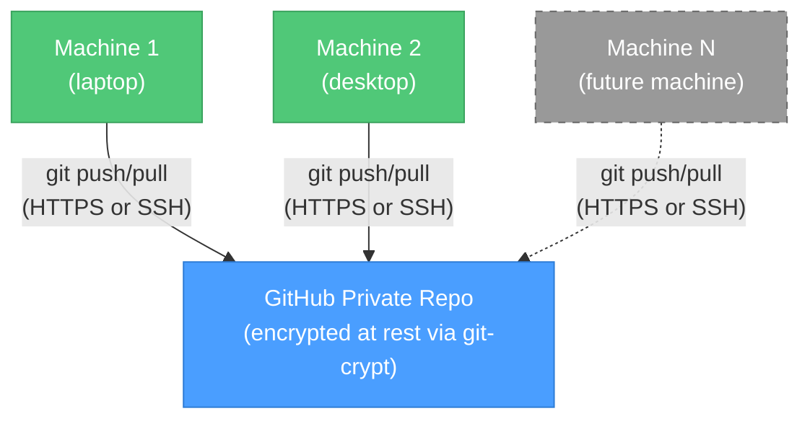

# "Wait, I already told you this" -- Claude Memory Sync

[](LICENSE)
[](https://www.gnu.org/software/bash/)
[](https://claude.com/claude-code)
[](https://github.com/KerberosClaw/kc_claude_memory_sync/actions/workflows/test.yml)

[正體中文](README_zh.md)

Sync [Claude Code](https://claude.com/claude-code) memory across multiple machines using a GitHub private repo + git-crypt. No self-hosted servers, no SSH tunnels, no Tailscale -- just GitHub and an encryption key.

---

## The Problem (a.k.a. Why We Built This)

Here's a fun one: you spend an hour teaching Claude your coding preferences, your project architecture, your pet peeves about trailing whitespace. Claude dutifully remembers all of it -- in `~/.claude/projects/` as Markdown files. Beautiful.

Then you SSH into your home server, fire up a tmux session, and Claude greets you like a stranger. Because it is. Different machine, different memory, zero shared context. All those carefully accumulated preferences? Trapped on whatever machine you happened to be using when you taught them. And the machine you're on right now has no idea any of that ever happened.

We got tired of re-explaining ourselves, so we built this. One GitHub repo, git-crypt, and a hook that makes Claude's memory follow you across machines -- no self-hosted infrastructure required.

## Architecture

GitHub as the hub: your memory lives in an encrypted private repo. Every machine syncs to it. Think of it as a git remote, except the only thing it stores is Claude's opinions about your code style -- and it's encrypted at rest so GitHub can't read them either.



**How it actually works:**
- Claude writes a memory file -> `PostToolUse` hook fires -> auto `git commit + push`. You don't do anything.
- Push is fire-and-forget -- no internet? Push silently skips. No errors, no drama.
- Next time you're online, changes sync up automatically. It just works. (We're as surprised as you are.)
- Memory files are encrypted with AES-256 via git-crypt. On GitHub they're binary gibberish. On your machines, they're plain Markdown.

**Got a new machine?** Clone the repo, unlock with your key file, done. `./setup.sh join` handles the details.

## Prerequisites

Before we get started, you'll need a few things. Nothing exotic:

- Two or more macOS/Linux machines (sorry, we haven't tested on Windows -- PRs welcome if you're braver than us)
- Git, Python 3, `jq`, and `git-crypt` on all machines (`brew install jq git-crypt`)
- [GitHub CLI](https://cli.github.com/) (`gh`) installed and authenticated (`gh auth login`)
- Claude Code installed on all machines

No SSH keys to distribute, no bare repos to maintain, no Tailscale to configure. If you can push to GitHub, you're good.

## Quick Start

### 1. First Machine (run once, then share the key)

```bash
git clone https://github.com/KerberosClaw/kc_claude_memory_sync.git ~/dev/kc_claude_memory_sync
cd ~/dev/kc_claude_memory_sync
./setup.sh init
```

The script handles the boring parts:
1. Creates a private repo on GitHub via `gh`
2. Initializes git-crypt and exports the encryption key
3. Scoops up your existing memory files into the repo
4. Pushes everything (encrypted) to GitHub
5. Configures `autoMemoryDirectory` and the sync hook in Claude Code

**After init, back up the key file.** The script tells you where it is. Copy it to your other machines via scp, USB, AirDrop, carrier pigeon -- whatever you trust.

### 2. Additional Machines (each one that wants in)

```bash
git clone https://github.com/KerberosClaw/kc_claude_memory_sync.git ~/dev/kc_claude_memory_sync
cd ~/dev/kc_claude_memory_sync
./setup.sh join
```

This will:
1. Clone the memory repo from GitHub
2. Unlock it with your git-crypt key
3. Merge any local memory files, with conflict detection so nothing gets silently lost
4. Configure `autoMemoryDirectory` and the sync hook

### Non-Interactive Mode (For Automation)

```bash
# First machine
./setup.sh init --repo-name kc_claude_memory --local-repo ~/dev/kc_claude_memory

# Additional machines
./setup.sh join --repo-url https://github.com/user/repo.git --key-file /tmp/key --local-repo ~/dev/kc_claude_memory
```

### The Lazy Way (Claude Code Automation)

A `CLAUDE.md` is included in the project. Just tell Claude Code "help me set up memory sync" and it will read the instructions and handle everything. We wrote the automation guide so you don't have to think. You're welcome.

## How It Works

### The Hook That Does All the Work

A `PostToolUse` hook watches for `Write` and `Edit` tool calls. When Claude modifies a memory file, it:

1. Reads `autoMemoryDirectory` from settings to find the memory repo
2. Checks if the written file is inside that repo
3. `git add` + `git commit` + `git pull --rebase` + `git push` -- or if GitHub is unreachable, quietly moves on with its life

### Memory Merge (The "First Date" Problem)

When you run `join`, your local memories meet the repo's memories for the first time. It can be awkward. Here's how we handle it:

| Scenario | What Happens |
|----------|--------|
| File only on this machine | Added to repo -- the more memories, the merrier |
| File only on repo | Kept as-is |
| Same filename, same content | Skipped -- great minds think alike |
| Same filename, different content | Both kept (`*_conflict.md` for you to review -- we're not going to pick favorites) |
| `MEMORY.md` | Auto-merged: entries combined and deduplicated |

### Encryption (git-crypt)

All `*.md` files in the memory repo are encrypted using git-crypt (AES-256). This means:
- On GitHub: binary gibberish. Not even GitHub can read your memories.
- On your machines: plain Markdown, as if encryption doesn't exist.
- The encryption/decryption is transparent -- git handles it automatically via clean/smudge filters.

You need the key file to unlock the repo. Lose the key, lose access. Back it up.

### Manual Sync (For Control Freaks)

```bash
cd ~/dev/kc_claude_memory_sync
./sync.sh sync      # pull then push
./sync.sh pull      # pull only
./sync.sh push      # push only
./sync.sh status    # show sync status
```

### Sync Status (Am I Even Synced?)

When you're not sure if your memories made it across, `status` gives you the full picture:

```
$ ./sync.sh status

=== Claude Memory Sync Status ===

Remote:        https://github.com/your-username/kc_claude_memory.git
Last commit:   2026-03-21 14:32:05 +0800
               sync: update memory
Local changes: none
Sync state:    up to date
```

No more wondering "did my laptop push before I closed the lid?" -- just run status.

## Configuration

`config.sh` is auto-generated by setup and git-ignored (because it contains your repo URL):

```bash
# Claude Memory Sync Configuration
REPO_URL="https://github.com/your-username/kc_claude_memory.git"
LOCAL_REPO="~/dev/kc_claude_memory"
```

That's it. Two variables. The old version had YAML with SSH hosts, fallback IPs, timeouts, and bare repo paths. We don't miss it.

## File Structure

```
kc_claude_memory_sync/
├── setup.sh              # Setup wizard (init / join)
├── sync.sh               # Manual sync + status
├── uninstall.sh          # Remove settings and hook config
├── hooks/
│   └── memory-sync.sh    # Claude Code PostToolUse hook
├── lib/
│   ├── common.sh         # Shared functions (colors, locking, config)
│   └── merge-memory.sh   # Memory file merge + MEMORY.md dedup
├── specs/                # Historical spec-driven development artifacts
├── config.example.sh     # Example configuration
├── CLAUDE.md             # Claude Code automation instructions
├── LICENSE
├── .gitignore
└── .gitattributes
```

## Uninstall (We'll Miss You)

```bash
cd ~/dev/kc_claude_memory_sync
./uninstall.sh
```

Removes `autoMemoryDirectory` and the hook entry from settings.json. The synced repo is preserved in case you change your mind. (They always come back.)

## Honest Limitations

We believe in setting expectations, so here's what this tool *doesn't* do:

- **Key management is on you** -- lose the git-crypt key and you can't decrypt your memory on new machines. The encrypted blobs on GitHub are useless without it. Back up the key.
- **No auto-pull on session start** -- Claude Code doesn't have a session-start hook, so we can't magically pull when you open a new conversation. Workaround: `alias claude='cd ~/dev/kc_claude_memory_sync && ./sync.sh pull && cd - && claude'` or just let the next push pull first.
- **Last write wins** -- if two machines edit the same memory file simultaneously, the last push wins. In practice this rarely happens because Claude Code sessions are sequential, but now you know.

## License

MIT
