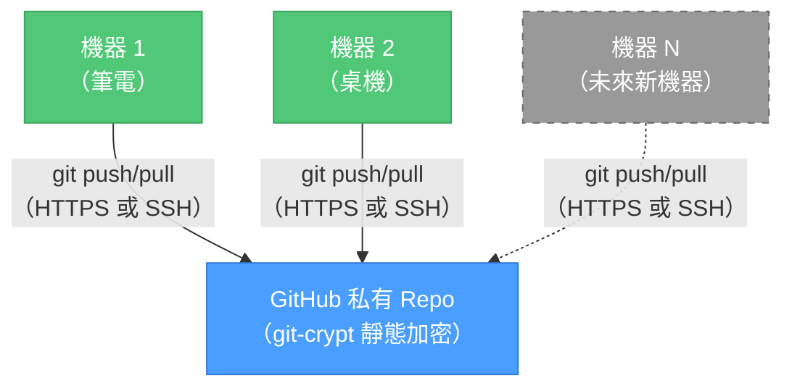

# 「我不是說過了嗎」-- Claude 記憶同步

[](LICENSE)
[](https://www.gnu.org/software/bash/)
[](https://claude.com/claude-code)
[](https://github.com/KerberosClaw/kc_claude_memory_sync/actions/workflows/test.yml)

[English](README.md)

透過 GitHub 私有 repo + git-crypt，在多台機器之間同步 [Claude Code](https://claude.com/claude-code) 的記憶。不用自架伺服器、不用 SSH tunnel、不用 Tailscale——有 GitHub 和一把加密金鑰就夠了。

---

## 這東西在解決什麼問題

場景是這樣的：你花了一個小時教 Claude 你的 coding 習慣、專案架構、還有你對 trailing whitespace 的深仇大恨。Claude 乖乖記住了——存在 `~/.claude/projects/` 底下的 Markdown 檔案裡。很美好。

然後你 SSH 進家裡的 Mac Mini，開了一個 tmux session，Claude 用陌生人的口氣跟你打招呼。因為它確實不認識你。不同機器、不同記憶、零共享 context。你辛辛苦苦累積的那些偏好設定？被困在你當初教它的那台機器上。而你現在用的這台，對那一切一無所知。

我們受夠了每次都要重新自我介紹，所以寫了這個工具。一個 GitHub repo、git-crypt、加上一個 hook，讓 Claude 的記憶跟著你跑——不需要自架任何東西。

## 架構

GitHub 當 hub：你的記憶住在一個加密的私有 repo 裡，所有機器都跟它同步。你可以把它想成一個 git remote，只不過裡面存的是 Claude 對你程式碼風格的看法——而且在 GitHub 上是加密的，連 GitHub 自己都讀不到。



**實際上怎麼同步的：**
- Claude 寫入記憶檔 -> `PostToolUse` hook 觸發 -> 自動 `git commit + push`。你不用做任何事。
- Push 採 fire-and-forget——沒網路？Push 靜默跳過。沒有報錯、沒有崩潰。
- 下次連上網，變更自動同步上去。就這樣。（我們自己也有點驚訝它真的能用。）
- 記憶檔案透過 git-crypt 以 AES-256 加密。在 GitHub 上是一堆亂碼，在你的機器上是正常的 Markdown。

**買了新機器？** Clone repo、用金鑰解鎖、搞定。`./setup.sh join` 處理細節。

## 前置需求

開始之前需要準備一些東西，都不難：

- 兩台以上 macOS/Linux 機器（Windows 沒測過——如果你比我們勇敢，歡迎 PR）
- 所有機器都裝好 Git、Python 3、`jq`、`git-crypt`（`brew install jq git-crypt`）
- [GitHub CLI](https://cli.github.com/)（`gh`）已安裝並登入（`gh auth login`）
- 所有機器都裝好 Claude Code

不用散發 SSH key、不用維護 bare repo、不用設定 Tailscale。能 push 到 GitHub 就行。

## 快速開始

### 1. 第一台機器（跑一次，然後分享金鑰）

```bash
git clone https://github.com/KerberosClaw/kc_claude_memory_sync.git ~/dev/kc_claude_memory_sync
cd ~/dev/kc_claude_memory_sync
./setup.sh init
```

腳本會處理那些無聊的事：
1. 透過 `gh` 在 GitHub 上建立私有 repo
2. 初始化 git-crypt 並匯出加密金鑰
3. 把現有的記憶檔案撈進 repo
4. 全部（加密後）push 到 GitHub
5. 設定 Claude Code 的 `autoMemoryDirectory` 和同步 hook

**init 完成後，備份金鑰檔。** 腳本會告訴你在哪裡。用 scp、USB、AirDrop、信鴿——隨你喜歡——把它傳到其他機器。

### 2. 其他機器（每台想加入的都跑一次）

```bash
git clone https://github.com/KerberosClaw/kc_claude_memory_sync.git ~/dev/kc_claude_memory_sync
cd ~/dev/kc_claude_memory_sync
./setup.sh join
```

會做這些事：
1. 從 GitHub clone 記憶 repo
2. 用你的 git-crypt 金鑰解鎖
3. 合併本機記憶，附帶衝突偵測，不會偷偷覆蓋你的東西
4. 設定 `autoMemoryDirectory` 和同步 hook

### 非互動模式（自動化用）

```bash
# 第一台機器
./setup.sh init --repo-name kc_claude_memory --local-repo ~/dev/kc_claude_memory

# 其他機器
./setup.sh join --repo-url https://github.com/user/repo.git --key-file /tmp/key --local-repo ~/dev/kc_claude_memory
```

### 懶人模式（Claude Code 自動化）

專案裡有一份 `CLAUDE.md`。直接跟 Claude Code 說「幫我設定記憶同步」，它會自己讀完說明然後全部搞定。我們寫了自動化指引就是為了讓你不用動腦。不客氣。

## 運作方式

### 那個幹完所有活的 Hook

`PostToolUse` hook 監聽 `Write` 和 `Edit` 工具呼叫。當 Claude 修改記憶檔案時：

1. 從 settings 讀取 `autoMemoryDirectory` 找到記憶 repo
2. 檢查寫入的檔案是否在 repo 裡
3. `git add` + `git commit` + `git pull --rebase` + `git push`——連不到 GitHub 的話，就安靜地繼續過日子

### 記憶合併（又叫「第一次見面好尷尬」問題）

跑 `join` 的時候，你本機的記憶會跟 repo 裡的記憶第一次碰面。場面可能有點微妙。我們是這樣處理的：

| 情況 | 怎麼處理 |
|------|---------|
| 檔案只在本機有 | 加入 repo——記憶越多越好 |
| 檔案只在 repo 有 | 保留 |
| 同檔名、同內容 | 跳過——英雄所見略同 |
| 同檔名、不同內容 | 兩個都保留（`*_conflict.md` 讓你自己看著辦——我們不選邊站） |
| `MEMORY.md` | 自動合併：索引條目合併去重 |

### 加密（git-crypt）

記憶 repo 裡所有 `*.md` 檔案都用 git-crypt（AES-256）加密。也就是說：
- 在 GitHub 上：一堆亂碼。連 GitHub 自己都讀不到你的記憶。
- 在你的機器上：正常的 Markdown，加密彷彿不存在。
- 加解密完全透明——git 透過 clean/smudge filter 自動處理。

你需要金鑰檔才能解鎖 repo。金鑰弄丟 = 失去存取權。請備份。

### 手動同步（給控制狂用的）

```bash
cd ~/dev/kc_claude_memory_sync
./sync.sh sync      # 先 pull 再 push
./sync.sh pull      # 只 pull
./sync.sh push      # 只 push
./sync.sh status    # 顯示同步狀態
```

### 同步狀態（到底有沒有同步啊？）

不確定記憶有沒有同步過去的時候，`status` 給你完整報告：

```
$ ./sync.sh status

=== Claude Memory Sync Status ===

Remote:        https://github.com/your-username/kc_claude_memory.git
Last commit:   2026-03-21 14:32:05 +0800
               sync: update memory
Local changes: none
Sync state:    up to date
```

再也不用猜「我闔上螢幕之前到底 push 了沒」——跑一下 status 就知道。

## 設定

`config.sh` 由 setup 自動產生，已 git-ignore：

```bash
# Claude Memory Sync Configuration
REPO_URL="https://github.com/your-username/kc_claude_memory.git"
LOCAL_REPO="~/dev/kc_claude_memory"
```

就這樣，兩個變數。舊版有 YAML 加上 SSH host、備援 IP、timeout、bare repo 路徑。我們不懷念。

## 檔案結構

```
kc_claude_memory_sync/
├── setup.sh              # 設定精靈（init / join）
├── sync.sh               # 手動同步 + 狀態
├── uninstall.sh          # 移除設定和 hook
├── hooks/
│   └── memory-sync.sh    # Claude Code PostToolUse hook
├── lib/
│   ├── common.sh         # 共用函式（顏色、lock、config）
│   └── merge-memory.sh   # 記憶檔合併 + MEMORY.md 去重
├── specs/                # 歷史 spec 文件
├── config.example.sh     # 設定範例
├── CLAUDE.md             # Claude Code 自動化指引
├── LICENSE
├── .gitignore
└── .gitattributes
```

## 移除（我們會想你的）

```bash
cd ~/dev/kc_claude_memory_sync
./uninstall.sh
```

從 settings.json 移除 `autoMemoryDirectory` 和 hook 設定。已同步的 repo 會保留，以防你改變心意。（他們都會回來的。）

## 老實說的限制

我們相信坦誠相見，所以這個工具「不能」做的事：

- **金鑰管理靠你自己**——git-crypt 金鑰弄丟的話，新機器就無法解密記憶。GitHub 上的加密檔案沒有金鑰就是廢物。請備份。
- **對話開始時不會自動 pull**——Claude Code 沒有 session-start hook，所以我們沒辦法在你開新對話時神奇地 pull。解法：`alias claude='cd ~/dev/kc_claude_memory_sync && ./sync.sh pull && cd - && claude'`，或直接讓下次 push 時順便 pull。
- **最後寫入者勝出**——如果兩台機器同時編輯同一個記憶檔，最後 push 的贏。實務上很少發生，因為 Claude Code session 通常是循序的，但讓你知道一下。

## License

MIT
