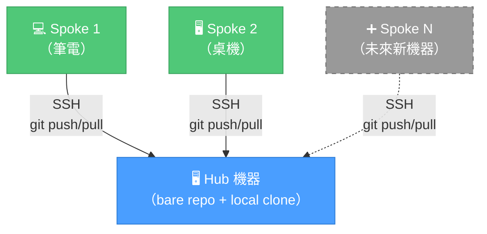

# 「我不是說過了嗎」-- Claude 記憶同步

[](LICENSE)
[](https://www.gnu.org/software/bash/)
[](https://claude.com/claude-code)

[English](README.md)

透過 SSH + Git bare repo，在多台機器之間同步 [Claude Code](https://claude.com/claude-code) 的記憶。不經雲端、不靠第三方——記憶資料完全留在自己的機器上。

---

## 這東西在解決什麼問題

場景是這樣的：你花了一個小時教 Claude 你的 coding 習慣、專案架構、還有你對 trailing whitespace 的深仇大恨。Claude 乖乖記住了——存在 `~/.claude/projects/` 底下的 Markdown 檔案裡。很美好。

然後你 SSH 進家裡的 Mac Mini，開了一個 tmux session，Claude 用陌生人的口氣跟你打招呼。因為它確實不認識你。不同機器、不同記憶、零共享 context。你辛辛苦苦累積的那些偏好設定？被困在你當初教它的那台機器上。而你現在用的這台，對那一切一無所知。

我們受夠了每次都要重新自我介紹，所以寫了這個工具。一個 bare repo、SSH、加上一個 hook，讓 Claude 的記憶跟著你跑——不需要任何雲端服務。

## 架構

星狀拓撲（Hub-and-Spoke）：一台機器掌握真相（Hub），其他人都跟它同步。你可以把它想成一個 git remote，只不過裡面存的是 Claude 對你程式碼風格的看法。



**實際上怎麼同步的：**
- Claude 寫入記憶檔 -> `PostToolUse` hook 觸發 -> 自動 `git commit + push`。你不用做任何事。
- Push 採 fire-and-forget——帶著筆電跑去沒有 VPN 的咖啡廳？Push 靜默跳過。沒有報錯、沒有崩潰。
- 下次回到同一個網路，變更自動同步上去。就這樣。（我們自己也有點驚訝它真的能用。）

**買了新機器？** 跑一行 `./setup.sh join` 就好。不用改 Hub 設定、不用通知其他 Spoke、不用獻祭。

## 前置需求

開始之前需要準備一些東西，都不難：

- 兩台以上 macOS/Linux 機器（Windows 沒測過——如果你比我們勇敢，歡迎 PR）
- 所有機器都裝好 Git、Python 3、`jq`（`brew install jq`）
- 所有機器都裝好 Claude Code
- 每台 Spoke 到 Hub 的免密碼 SSH。沒設定過的話，一行指令搞定：
  ```bash
  ssh-copy-id -i ~/.ssh/id_ed25519.pub user@hub-host
  ```

## 快速開始

### 1. Hub 機器（跑一次，然後忘了它的存在）

```bash
git clone https://github.com/<your-user>/kc_claude_memory_sync.git ~/dev/kc_claude_memory_sync
cd ~/dev/kc_claude_memory_sync
./setup.sh init-hub
```

腳本會處理那些無聊的事：
1. 在本機建立 Git bare repo
2. 把現有的記憶檔案撈進 repo
3. 自動合併並去重 `MEMORY.md` 索引（因為你一定有重複的條目）
4. 建立 symlink 和 Claude Code hook

### 2. Spoke 機器（每台想加入的都跑一次）

```bash
git clone https://github.com/<your-user>/kc_claude_memory_sync.git ~/dev/kc_claude_memory_sync
cd ~/dev/kc_claude_memory_sync
./setup.sh join
```

會做這些事：
1. 驗證到 Hub 的 SSH 連線（連不上就直接報錯收工——省得你白等）
2. 從 Hub clone 記憶 repo
3. 合併本機記憶，附帶衝突偵測，不會偷偷覆蓋你的東西
4. 建立 symlink 和 Claude Code hook

### 懶人模式（Claude Code 自動化）

專案裡有一份 `CLAUDE.md`。直接跟 Claude Code 說「幫我設定記憶同步」，它會自己讀完說明然後全部搞定。我們寫了自動化指引就是為了讓你不用動腦。不客氣。

## 運作方式

### 那個幹完所有活的 Hook

`PostToolUse` hook 監聽 `Write` 和 `Edit` 工具呼叫。當 Claude 修改記憶檔案時，三件事依序發生：

1. Hook 偵測到檔案位於記憶 repo 中（追蹤 symlink、檢查真實路徑——沒那麼容易被騙）
2. 取得 file lock（因為如果你同時開了三個 tmux pane 跑 Claude，我們可不想三個 `git push` 在那邊打架）
3. `git add` + `git commit` + `git push`——連不到 Hub 的話，就安靜地繼續過日子

### 記憶合併（又叫「第一次見面好尷尬」問題）

跑 `join` 的時候，你本機的記憶會跟 Hub 上的記憶第一次碰面。場面可能有點微妙。我們是這樣處理的：

| 情況 | 怎麼處理 |
|------|---------|
| 檔案只在本機有 | 加入 repo——記憶越多越好 |
| 檔案只在 Hub 有 | 保留 |
| 同檔名、同內容 | 跳過——英雄所見略同 |
| 同檔名、不同內容 | 兩個都保留（`*_conflict.md` 讓你自己看著辦——我們不選邊站） |
| `MEMORY.md` | 自動合併：索引條目合併去重 |

### 手動同步（給控制狂用的）

```bash
~/dev/claude-memory/.sync.sh sync      # 先 pull 再 push
~/dev/claude-memory/.sync.sh pull      # 只 pull
~/dev/claude-memory/.sync.sh push      # 只 push
~/dev/claude-memory/.sync.sh status    # 顯示同步狀態
```

### 同步狀態（到底有沒有同步啊？）

不確定記憶有沒有同步過去的時候，`status` 給你完整報告：

```
$ ~/dev/claude-memory/.sync.sh status

=== Claude Memory Sync Status ===

Hub:           user@192.168.1.100 — reachable
Last commit:   2026-03-21 14:32:05 +0800
               memory sync 2026-03-21 14:32:05 from myhost
Local changes: none
Sync state:    up to date
```

再也不用猜「我闔上螢幕之前到底 push 了沒」——跑一下 status 就知道。

## 設定

`config.yaml` 由 setup 自動產生，已 git-ignore（因為裡面有你的網路資訊，我們不是野蠻人）：

```yaml
hub:
  host: 192.168.1.100
  user: username
  bare_repo: ~/git/claude-memory.git

ssh:
  key: ~/.ssh/id_ed25519
  timeout: 3

sync:
  local_repo: ~/dev/claude-memory
  # memory_dir: 自動偵測，有需要才覆寫
```

| 欄位 | 說明 | 預設值 |
|------|------|--------|
| `hub.host` | Hub 的 SSH host/IP | -- |
| `hub.user` | Hub 的 SSH 使用者名稱 | -- |
| `hub.bare_repo` | Hub 上 bare repo 路徑 | `~/git/claude-memory.git` |
| `ssh.key` | SSH 私鑰路徑 | `~/.ssh/id_ed25519` |
| `ssh.timeout` | SSH 連線逾時（秒） | `3` |
| `sync.local_repo` | 本地 working repo | `~/dev/claude-memory` |
| `sync.memory_dir` | Claude Code 記憶目錄 | 自動偵測 |

## 檔案結構

```
kc_claude_memory_sync/
├── setup.sh              # 設定精靈（init-hub / join）
├── sync.sh               # 同步 + 狀態腳本
├── uninstall.sh          # 還原原始記憶目錄
├── hooks/
│   └── memory-sync.sh    # Claude Code PostToolUse hook
├── lib/
│   ├── common.sh         # 共用函式（YAML 解析、lock、SSH）
│   └── merge-memory.sh   # 記憶檔合併 + MEMORY.md 去重
├── config.example.yaml   # 設定範例
├── CLAUDE.md             # Claude Code 自動化指引
├── LICENSE
├── .gitignore
└── .gitattributes
```

## 移除（我們會想你的）

```bash
cd ~/dev/kc_claude_memory_sync
./uninstall.sh
```

還原原本的記憶目錄、移除 hook 腳本和 settings.json 設定。已同步的 repo 會保留，以防你改變心意。（他們都會回來的。）

## 老實說的限制

我們相信坦誠相見，所以這個工具「不能」做的事：

- **僅限區網同步**——需要 SSH 連到 Hub。沒網路、沒 VPN、就沒同步。變更會暫存在本地，下次連上時自動 push。這不是 bug，是隱私功能。（好吧，是限制。）
- **對話開始時不會自動 pull**——Claude Code 沒有 session-start hook，所以我們沒辦法在你開新對話時神奇地 pull。開工前跑一下 `sync.sh pull`，或直接用 `sync.sh sync` 讓它先 pull 再 push。
- **單一 Hub**——一個 bare repo server，所有 Spoke 連過去。Hub 掛了，同步暫停。不過你本機的記憶完全不受影響。

## License

MIT
